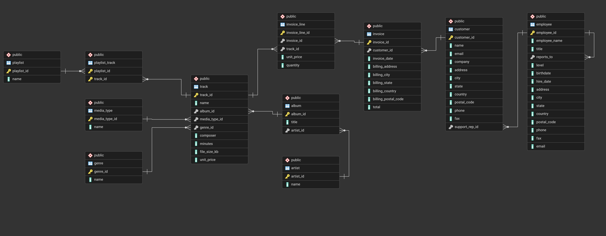

# 🎵 Apple iTunes Music Store – Business Analysis
## 📌 Project Overview

This project presents an end-to-end SQL-based business analysis of the Apple iTunes Music Store database. The objective was to evaluate revenue performance, customer purchasing behavior, genre and artist contribution, and geographic sales distribution to uncover strategic growth opportunities.

Using structured SQL queries (including joins, aggregations, CTEs, and window functions), the analysis translates raw transactional data into actionable business insights and revenue optimization strategies.

## Problem Statement

Apple iTunes maintains a large digital music store with millions of tracks, thousands of customers worldwide, and a network of employees managing sales operations. As thestore expands globally, leadership needs insights into customer purchasing behavior, top-performing genres, and regional revenue distribution to improve marketing and content strategy.

## 🧩 Business Objectives
- Analyze revenue trends and seasonality
- Evaluate customer lifetime value and retention behavior
- Identify top-performing artists and genres
- Assess geographic revenue concentration
- Detect underserved regions and monetization gaps
- Provide strategic recommendations to improve revenue performance

## 📁Project Structure

```
itunes-music-analysis/
│
├── Dataset/             # CSV files
├── Schema/              # Table creation scripts
├── Queries/             # Analytical SQL queries
├── Report/              # Final business report (PDF)
└── README.md
```

## 🗄️Database Overview



## 📊Key Insights
- Average Customer Lifetime Value (CLV): $79.82
- Average purchases per customer: ~10
- Rock contributes nearly 60% of total genre revenue
- Queen contributes 25% of Top 5 artist revenue
- Revenue gap between top and lowest region: 89%
- Top 3 employees generate 100% of recorded revenue

## 🚀 Business Recommendations
- Implement loyalty programs to increase CLV
- Launch reactivation campaigns to address recent inactivity
- Double down on high-performing genres (Rock) while diversifying emerging genres
- Allocate marketing investment to high-value regions (Czech Republic)
- Target underserved regions with localized promotions
### 🎯Impact - Estimated potential revenue uplift: 10–15%

## 🛠️ Tools & Technologies
- SQL (PostgreSQL)
- Relational Database Modeling
- Aggregations & Grouping
- CTEs
- Window Functions (RANK, LAG)

## 📌Conclusion
The iTunes music store demonstrates strong historical customer loyalty and clear genre dominance, particularly in Rock music. However, recent inactivity and geographic monetization gaps present immediate opportunities for targeted intervention. By implementing loyalty programs, seasonal optimization strategies, geographic targeting, and genre diversification initiatives, the business can potentially increase overall revenue by 10–15% while reducing dependency risk on a single genre.
